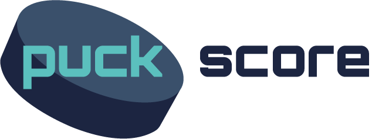

# About

PuckScores is a web app made with React.JS that uses the NHL's API to display live scores and standings.

# Scores

The scores tab currently displays the current scores for the current day. Users can select the forward or backward arrows in the date selector to browse through prevoius and future match ups. When a game is selected a larger game view will appear. This game view will either show a preview of the matchup, show the current status of the game including scoring plays, or show the final result including the three stars of the game.

# Standings

The standings tab currently displays league standings sorted by points by default. Users can click on either 'Conference' or 'Division' to see those specific standings. Users may also sort standings by clicking on either the 'Points' or 'Points %' titles.
